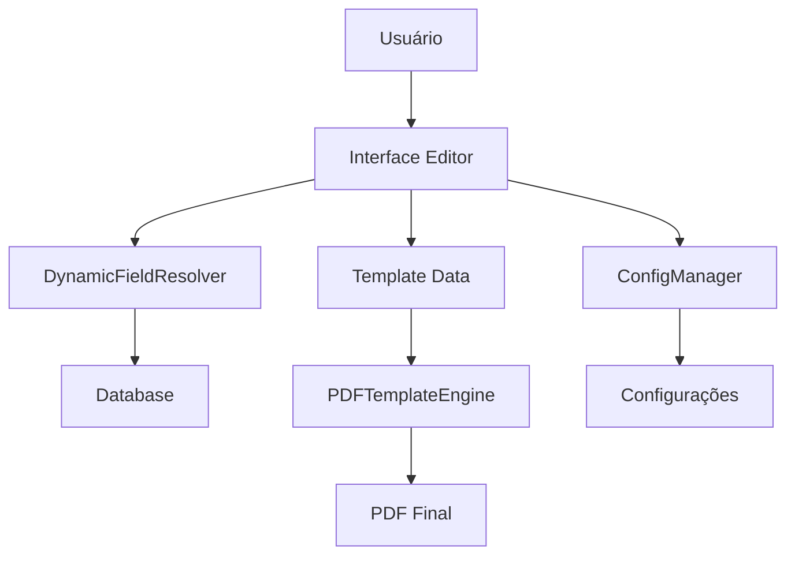

# 🚀 Editor PDF Avançado - Documentação Técnica

## 📋 Visão Geral Técnica

O Editor PDF Avançado é um sistema modular e extensível para criação visual de templates de PDF com integração total ao banco de dados. A arquitetura foi projetada para ser escalável, maintível e facilmente extensível.

## 🏗️ Arquitetura do Sistema

### Estrutura de Arquivos

```
📁 Editor PDF Avançado/
├── 📄 interface/modules/editor_pdf_avancado.py    # Interface principal
├── 📄 utils/dynamic_field_resolver.py             # Resolvedor de campos dinâmicos
├── 📄 utils/pdf_template_engine.py                # Engine de geração PDF
├── 📄 utils/editor_config.py                      # Sistema de configuração
├── 📄 utils/template_manager.py                   # Gerenciador de templates
├── 📄 requirements_editor_avancado.txt            # Dependências
├── 📄 MANUAL_EDITOR_AVANCADO.md                   # Manual do usuário
└── 📄 DESENVOLVIMENTO_EDITOR_AVANCADO.md          # Este arquivo
```

### Componentes Principais

#### 1. **EditorPDFAvancadoModule** (`interface/modules/editor_pdf_avancado.py`)
- **Responsabilidade**: Interface principal do editor
- **Funcionalidades**:
  - Interface gráfica com 3 colunas (controles, preview, propriedades)
  - Sistema de eventos para interação com canvas
  - Gerenciamento de elementos visuais
  - Seleção múltipla e ferramentas de alinhamento
  - Menu contextual com opções avançadas

#### 2. **DynamicFieldResolver** (`utils/dynamic_field_resolver.py`)
- **Responsabilidade**: Resolução de campos dinâmicos
- **Funcionalidades**:
  - Conexão com banco de dados
  - Mapeamento de campos por categoria (cliente, cotação, etc.)
  - Formatação automática de valores
  - Cache de dados para performance

#### 3. **PDFTemplateEngine** (`utils/pdf_template_engine.py`)
- **Responsabilidade**: Geração de PDF final
- **Funcionalidades**:
  - Conversão de elementos visuais para PDF
  - Suporte a múltiplos tipos de elemento
  - Sistema de templates e estilos
  - Validação antes da geração

#### 4. **EditorConfigManager** (`utils/editor_config.py`)
- **Responsabilidade**: Gerenciamento de configurações
- **Funcionalidades**:
  - Configurações por usuário
  - Temas e personalização
  - Auto-save e backup
  - Validação e performance

## 🎨 Fluxo de Dados



### 1. **Carregamento de Dados**
```python
# Sequência de inicialização
1. Carregar configurações do usuário
2. Inicializar resolvedor de campos dinâmicos
3. Configurar interface gráfica
4. Carregar template padrão
5. Gerar preview inicial
```

### 2. **Interação do Usuário**
```python
# Ciclo de edição
1. Usuário seleciona cotação → Carregar dados dinâmicos
2. Usuário adiciona elemento → Atualizar template_data
3. Elemento é modificado → Regenerar preview
4. Auto-save periódico → Salvar template
5. Gerar PDF → Converter template para PDF
```

## 💾 Estrutura de Dados

### Template Data Structure
```json
{
  "pages": [
    {
      "id": 1,
      "name": "Capa",
      "type": "Capa",
      "elements": [
        {
          "id": "elem_123",
          "type": "text",
          "x": 50,
          "y": 100,
          "text": "Texto exemplo",
          "font_family": "Arial",
          "font_size": 12,
          "color": "#000000",
          "bold": false,
          "italic": false
        },
        {
          "id": "elem_124",
          "type": "dynamic_field",
          "x": 50,
          "y": 150,
          "field_ref": "cliente.nome",
          "font_family": "Arial",
          "font_size": 14,
          "color": "#1f2937"
        }
      ]
    }
  ],
  "version": "1.0",
  "created_at": "2024-12-10T10:00:00"
}
```

### Tipos de Elementos Suportados

#### **Text Element**
```json
{
  "type": "text",
  "text": "Texto estático",
  "font_family": "Arial|Times|Helvetica|Courier",
  "font_size": 8-72,
  "color": "#RRGGBB",
  "bold": boolean,
  "italic": boolean,
  "align": "left|center|right"
}
```

#### **Dynamic Field Element**
```json
{
  "type": "dynamic_field",
  "field_ref": "categoria.campo",
  "font_family": "Arial",
  "font_size": 12,
  "color": "#000000",
  "format": "text|currency|date"
}
```

#### **Image Element**
```json
{
  "type": "image",
  "image_path": "/path/to/image",
  "width": 100,
  "height": 100,
  "maintain_aspect": boolean
}
```

#### **Table Element**
```json
{
  "type": "table",
  "rows": 3,
  "cols": 4,
  "data": [["Header1", "Header2"], ["Data1", "Data2"]],
  "header_style": {},
  "cell_style": {}
}
```

## 🔧 APIs e Interfaces

### Interface Principal

#### **Métodos Públicos**
```python
class EditorPDFAvancadoModule:
    def load_cotacao_data(self, cotacao_id: int) -> bool
    def generate_visual_preview(self) -> None
    def generate_final_pdf(self) -> bool
    def save_template(self) -> bool
    def load_template(self, filepath: str) -> bool
    def add_element_to_canvas(self, element_type: str) -> None
    def select_element(self, canvas_id: int) -> None
    def delete_selected_elements(self) -> None
```

#### **Eventos de Canvas**
```python
# Eventos principais
'<Button-1>': on_canvas_click           # Seleção simples
'<Control-Button-1>': on_canvas_ctrl_click  # Seleção múltipla
'<Double-Button-1>': on_canvas_double_click # Edição rápida
'<Button-3>': on_canvas_right_click     # Menu contextual
'<B1-Motion>': on_canvas_drag           # Arrastar elementos
'<Delete>': delete_selected_elements    # Excluir
```

### Dynamic Field Resolver

#### **Referências de Campos**
```python
# Formato: categoria.campo
"cliente.nome"              # Nome do cliente
"cliente.cnpj"              # CNPJ formatado
"cotacao.numero_proposta"   # Número da proposta
"cotacao.valor_total"       # Valor total (R$ X,XX)
"responsavel.nome_completo" # Nome do responsável
"item.quantidade"           # Quantidade do item (índice específico)
"meta.data_hoje"            # Data atual
"meta.total_itens"          # Total de itens calculado
```

#### **Métodos de Resolução**
```python
class DynamicFieldResolver:
    def resolve_field(self, field_ref: str, item_index: int = None) -> str
    def resolve_template_text(self, text: str) -> str
    def load_cotacao_data(self, cotacao_id: int) -> bool
    def get_available_fields(self) -> Dict[str, List[Dict]]
```

### PDF Template Engine

#### **Geração de PDF**
```python
class PDFTemplateEngine:
    def generate_pdf(self, output_path: str, metadata: Dict = None) -> bool
    def validate_template(self) -> Tuple[bool, List[str]]
    def generate_preview_image(self, page_index: int = 0) -> Optional[str]
```

## 🎛️ Sistema de Configuração

### Configurações por Categoria

#### **Tema (EditorTheme)**
```python
@dataclass
class EditorTheme:
    primary_color: str = "#3b82f6"
    secondary_color: str = "#10b981"
    background_color: str = "#f8fafc"
    canvas_background: str = "#ffffff"
    selection_color: str = "#3b82f6"
```

#### **Grade (GridSettings)**
```python
@dataclass
class GridSettings:
    enabled: bool = True
    size: int = 20
    snap_to_grid: bool = True
    show_grid: bool = True
    color: str = "#f0f0f0"
```

#### **Performance (PerformanceSettings)**
```python
@dataclass
class PerformanceSettings:
    max_undo_steps: int = 50
    render_quality: str = "medium"
    preview_update_delay_ms: int = 1500
```

### Uso das Configurações
```python
# Obter configuração atual
config = get_config()

# Atualizar configuração específica
update_config(**{"theme.primary_color": "#ff0000"})

# Aplicar tema pré-definido
apply_theme("dark")

# Configuração por usuário
config_manager.load_user_config(user_id)
```

## 🔌 Extensibilidade

### Adicionando Novo Tipo de Elemento

#### 1. **Definir Estrutura de Dados**
```python
# No template_data
{
  "type": "novo_elemento",
  "x": 0,
  "y": 0,
  "propriedade_especifica": "valor",
  "outra_propriedade": 123
}
```

#### 2. **Implementar Desenho no Canvas**
```python
def draw_novo_elemento(self, element, x, y):
    """Desenhar novo elemento no canvas visual"""
    # Implementação do desenho
    canvas_id = self.visual_canvas.create_...
    element['canvas_id'] = canvas_id
```

#### 3. **Implementar Geração PDF**
```python
def process_novo_elemento(self, element):
    """Processar elemento para PDF"""
    # Conversão para ReportLab
    return reportlab_element
```

#### 4. **Adicionar ao Menu**
```python
# Em setup_visual_elements_tab()
("🆕 Novo Elemento", "novo_elemento")
```

### Adicionando Nova Categoria de Campos

#### 1. **Definir Mapeamento**
```python
# Em DynamicFieldResolver
'nova_categoria': {
    'campo1': 'Descrição do Campo 1',
    'campo2': 'Descrição do Campo 2'
}
```

#### 2. **Implementar Query SQL**
```python
def load_nova_categoria_data(self, id):
    cursor.execute("""
        SELECT campo1, campo2
        FROM nova_tabela
        WHERE id = ?
    """, (id,))
```

#### 3. **Adicionar à Interface**
```python
# Em setup_field_categories()
nova_frame = tk.LabelFrame(parent, text="🆕 Nova Categoria")
```

## 🧪 Testing

### Estrutura de Testes
```
tests/
├── test_editor_interface.py       # Testes da interface
├── test_field_resolver.py         # Testes de campos dinâmicos
├── test_pdf_engine.py             # Testes de geração PDF
├── test_configuration.py          # Testes de configuração
└── fixtures/                      # Dados de teste
    ├── sample_templates.json
    ├── sample_database.db
    └── test_images/
```

### Exemplo de Teste
```python
import pytest
from utils.dynamic_field_resolver import DynamicFieldResolver

class TestDynamicFieldResolver:
    def test_resolve_cliente_field(self):
        resolver = DynamicFieldResolver("test.db")
        resolver.load_cotacao_data(1)
        
        result = resolver.resolve_field("cliente.nome")
        assert result == "EMPRESA TESTE LTDA"
    
    def test_resolve_invalid_field(self):
        resolver = DynamicFieldResolver("test.db")
        
        result = resolver.resolve_field("invalid.field")
        assert result == "[invalid.field]"
```

### Executar Testes
```bash
# Instalar dependências de teste
pip install pytest pytest-cov

# Executar todos os testes
pytest tests/

# Executar com cobertura
pytest --cov=interface --cov=utils tests/

# Executar testes específicos
pytest tests/test_field_resolver.py::TestDynamicFieldResolver::test_resolve_cliente_field
```

## 🚀 Performance

### Otimizações Implementadas

#### **1. Cache de Dados**
- Cache de campos dinâmicos após carregamento
- Cache de previews gerados
- Cache de configurações por usuário

#### **2. Lazy Loading**
- Carregar dados apenas quando necessário
- Preview gerado sob demanda
- Elementos renderizados conforme visibilidade

#### **3. Debouncing**
- Atraso de 1.5s para atualização de preview
- Agrupamento de mudanças múltiplas
- Evita re-renderização excessiva

#### **4. Otimização de Canvas**
- Usar tags para agrupamento de elementos
- Redesenhar apenas elementos alterados
- Grid pré-calculado

### Monitoramento de Performance
```python
import time
import functools

def performance_monitor(func):
    @functools.wraps(func)
    def wrapper(*args, **kwargs):
        start = time.time()
        result = func(*args, **kwargs)
        end = time.time()
        print(f"{func.__name__}: {end - start:.3f}s")
        return result
    return wrapper

# Uso
@performance_monitor
def generate_visual_preview(self):
    # Implementação
    pass
```

## 🔒 Segurança

### Validação de Entrada
```python
def validate_element_data(element):
    """Validar dados de elemento"""
    required_fields = ['type', 'x', 'y']
    
    for field in required_fields:
        if field not in element:
            raise ValueError(f"Campo obrigatório ausente: {field}")
    
    # Validação de tipos
    if not isinstance(element['x'], (int, float)):
        raise TypeError("Coordenada X deve ser numérica")
```

### Sanitização de Dados
```python
def sanitize_text_input(text):
    """Sanitizar entrada de texto"""
    # Remover caracteres perigosos
    dangerous_chars = ['<', '>', '&', '"', "'"]
    for char in dangerous_chars:
        text = text.replace(char, '')
    
    # Limitar tamanho
    return text[:1000]
```

### Controle de Acesso
```python
def check_user_permissions(self, action):
    """Verificar permissões do usuário"""
    if self.user_info['role'] not in ['admin', 'editor']:
        raise PermissionError("Usuário sem permissão para esta ação")
```

## 📊 Logging e Debugging

### Sistema de Logs
```python
import logging

# Configurar logging
logging.basicConfig(
    level=logging.INFO,
    format='%(asctime)s - %(name)s - %(levelname)s - %(message)s',
    handlers=[
        logging.FileHandler('editor_avancado.log'),
        logging.StreamHandler()
    ]
)

logger = logging.getLogger('EditorPDFAvancado')

# Uso
logger.info("Template carregado com sucesso")
logger.warning("Campo dinâmico não encontrado")
logger.error("Erro na geração do PDF")
```

### Modo Debug
```python
if config.debug_mode:
    print(f"Debug: Elemento selecionado - {element}")
    print(f"Debug: Dados da cotação - {cotacao_data}")
    
    # Salvar estado para debugging
    with open('debug_state.json', 'w') as f:
        json.dump(self.template_data, f, indent=2)
```

## 🔄 Versionamento

### Controle de Versão de Templates
```python
# Estrutura de versionamento
{
  "template_data": {...},
  "version": "1.2.3",
  "compatibility": {
    "min_version": "1.0.0",
    "max_version": "2.0.0"
  },
  "changelog": [
    {
      "version": "1.2.3",
      "date": "2024-12-10",
      "changes": ["Adicionado suporte a tabelas", "Corrigido bug de alinhamento"]
    }
  ]
}
```

### Migração de Versões
```python
def migrate_template(template_data, from_version, to_version):
    """Migrar template entre versões"""
    migrations = {
        "1.0.0_to_1.1.0": migrate_1_0_to_1_1,
        "1.1.0_to_1.2.0": migrate_1_1_to_1_2
    }
    
    migration_key = f"{from_version}_to_{to_version}"
    if migration_key in migrations:
        return migrations[migration_key](template_data)
    
    return template_data
```

## 📚 Documentação de API

### Métodos Principais

#### **load_cotacao_data(cotacao_id: int) -> bool**
Carrega dados de uma cotação específica.

**Parâmetros:**
- `cotacao_id`: ID da cotação no banco de dados

**Retorna:**
- `bool`: True se carregamento foi bem-sucedido

**Exemplo:**
```python
success = editor.load_cotacao_data(123)
if success:
    print("Dados carregados com sucesso")
```

#### **add_element_to_canvas(element_type: str) -> None**
Adiciona novo elemento ao canvas.

**Parâmetros:**
- `element_type`: Tipo do elemento ('text', 'image', 'table', etc.)

**Exemplo:**
```python
editor.add_element_to_canvas('text')
editor.add_element_to_canvas('dynamic_field')
```

#### **generate_final_pdf() -> bool**
Gera PDF final baseado no template atual.

**Retorna:**
- `bool`: True se geração foi bem-sucedida

**Exemplo:**
```python
if editor.generate_final_pdf():
    print("PDF gerado com sucesso")
```

## 🎯 Roadmap de Desenvolvimento

### Versão 1.1 (Próxima)
- [ ] Sistema de Undo/Redo completo
- [ ] Suporte a mais tipos de fonte
- [ ] Exportação para outros formatos (PNG, JPEG)
- [ ] Templates colaborativos

### Versão 1.2 (Futuro)
- [ ] Plugin system
- [ ] API REST para integração externa
- [ ] Suporte a campos calculados complexos
- [ ] Edição online (web interface)

### Versão 2.0 (Longo prazo)
- [ ] AI-assisted template creation
- [ ] Real-time collaboration
- [ ] Advanced analytics
- [ ] Mobile app support

## 🤝 Contribuição

### Guia para Desenvolvedores

#### **Setup do Ambiente de Desenvolvimento**
```bash
# 1. Clonar repositório
git clone [repo_url]

# 2. Criar ambiente virtual
python -m venv venv
source venv/bin/activate  # Linux/Mac
venv\Scripts\activate     # Windows

# 3. Instalar dependências
pip install -r requirements_editor_avancado.txt

# 4. Instalar dependências de desenvolvimento
pip install pytest black mypy

# 5. Executar testes
pytest tests/
```

#### **Padrões de Código**
- Usar Type Hints sempre que possível
- Documentar métodos públicos com docstrings
- Seguir PEP 8 (usar `black` para formatação)
- Manter cobertura de testes > 80%

#### **Processo de Contribuição**
1. Criar branch para nova feature
2. Implementar com testes
3. Executar validações (`black`, `mypy`, `pytest`)
4. Submeter Pull Request
5. Code review e merge

---

**Versão da Documentação**: 1.0  
**Última Atualização**: Dezembro 2024  
**Próxima Revisão**: Janeiro 2025